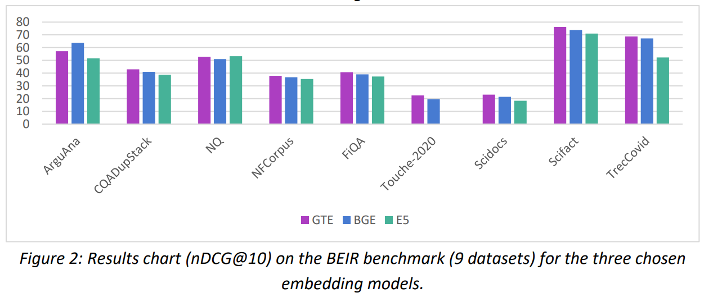

# Evaluate Embeddings
This repository contains the code and results for the embedding models and API evaluation portion of [This Paper](https://drive.google.com/file/d/10xBOwAYMxlGfQgf10AtbdlyrTRuNm95z/view?usp=drive_link) on a Comprehensive Evaluation of Embedding Models and Unraveling the Impact of Query Expansion.

## Introduction
This study focused on the vital role text embeddings play in information retrieval. The [BeIR](https://github.com/beir-cellar/beir) benchmark, known for its rigorous evaluation, serves as a fertile ground for comparative analysis. This study examines the performance of three prominent open-source embedding models — gte-base, bge-base-en-v1.5, and e5-base-v2 — within the BeIR framework. Furthermore, the study briefly analyzes two semantic embedding APIs, Cohere and VoyageAI, exploring whether their practicality and scalability benefits are complemented by improved accuracy. Given the prohibitively high cost of these APIs, the study aims to provide insights for
researchers in their cost-benefit analysis. The code and results of investigating the effects of query expansion on the performance of these embedding models can be found [here](https://github.com/Maham-Mukaram/query-expansion).


## Quickstart

### 1. Prerequisites

Our code can be compiled on Python 3 environments. The modules used in our code can be installed using:
```
$ pip install -r requirements
```

The embedding API codes use Cohere and VoyageAI's Python libraries. Please ensure that you set the 'API_key' argument to your Cohere and VoyageAI API keys. You can find your API key at [Cohere](https://dashboard.cohere.com/api-keys) and [VoyageAI](https://dash.voyageai.com/api-keys).


### 2. Evaluating on BeIR

Two sample datasets Natural Questions [Datasets/nq](Datasets/nq) and CQADupStack [Datasets/cqadupstack](Datasets/cqadupstack). You can download these datasets using the [BeIR Download Datasets file](https://github.com/beir-cellar/beir/blob/main/examples/dataset/download_dataset.py). The tasks/datasets defined in the code are:
```
TASK_LIST = [
    "arguana",
    "cqadupstack/android",
    "cqadupstack/english",
    "cqadupstack/gaming",
    "cqadupstack/gis",
    "cqadupstack/mathematica",
    "cqadupstack/physics",
    "cqadupstack/programmers",
    "cqadupstack/stats",
    "cqadupstack/stats",
    "cqadupstack/tex",
    "cqadupstack/unix",
    "cqadupstack/webmasters",
    "cqadupstack/wordpress",
    "fiqa",
    "nfcorpus",
    "nq",
    "scidocs",
    "scifact",
    "webis-touche2020",
    "trec-covid"
]
```
You can use 'startid' and 'endid' arguments to better define which tasks within the TASK_LIST you want to run. So for example, for Natural Questions dataset set:
```
--startid=16 \
--endid=17
```
To run an evaluation on the CQADupStack dataset present inside the datasets folder, please use the following commands:

For open-source embedding models:
1. [bge-base-en-v1.5](https://huggingface.co/BAAI/bge-base-en-v1.5)
2. [e5-base-v2](https://huggingface.co/intfloat/e5-base-v2)
3. [gte-base](https://huggingface.co/thenlper/gte-base)
```
$ python Implement_BeIR_SenTrans.py \
	--startid=1 \
	--endid=14 \
	--engine=infloat/e5-base-v2 \
	--lang=en \
	--batchsize=2048 \
	--queriesfile=queries.jsonl
```
In case of query expansion, you can define the 'queriesfile' argument as the expanded queries file, such as the [query expansion file](Datasets/nq/queries_Q2D.jsonl) of the Natural Questions Dataset:
```
$ python Implement_BeIR_SenTrans.py \
	--startid=16 \
	--endid=17 \
	--engine=infloat/e5-base-v2 \
	--lang=en \
	--batchsize=2048 \
	--queriesfile=queries_Q2D.jsonl
```

For Cohere API:
```
$ python Implement_BeIR_Cohere.py \
	--startid=1 \
	--endid=14 \
	--engine=embed-english-v3.0 \
	--lang=en \
	--batchsize=2048 \
	--queriesfile=queries.jsonl \
	--API_key=apiapiapiapiapi
```

For VoyageAI API:
```
$ python Implement_BeIR_VoyageAI.py \
	--startid=1 \
	--endid=14 \
	--engine=voyage-02 \
	--lang=en \
	--batchsizeBeIR=2048 \
	--batchsizeAPI=128 \
	--queriesfile=queries.jsonl \
	--API_key=apiapiapiapiapi
```
We have also provided two sample files for evaluating embedding APIs on the [MTEB benchmark](https://github.com/embeddings-benchmark/mteb). These files are for the [Cohere API](Implement_MTEB_Cohere.py) and [VoyageAI API](Implement_MTEB_VoyageAI.py).

### 3. Results
#### Open Source Embeddings

<p float="left">


</p>

#### Embedding APIs

<p float="left">


</p>

